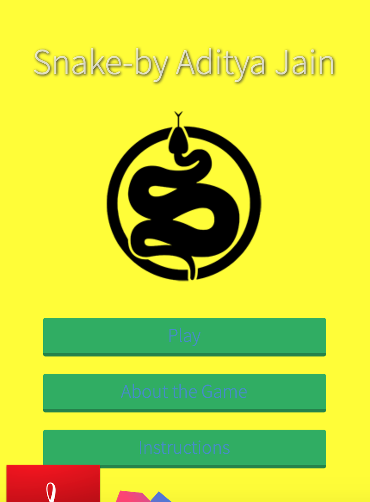
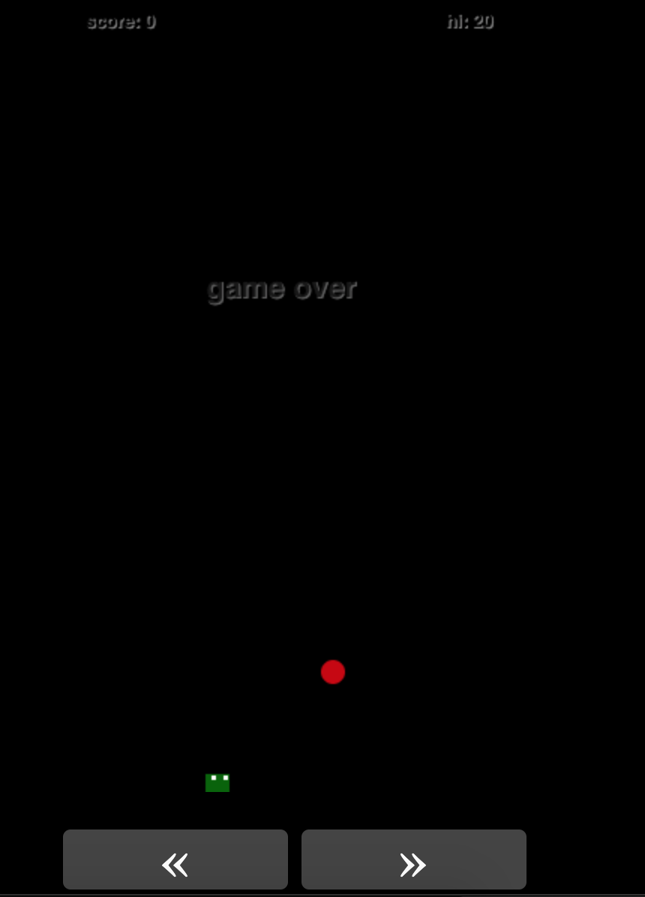

# SnakeApp
## About
In the game of Snake, the player moves the  "snake" around the board. As the snake finds food, it eats the food, and thereby grows larger. The game ends when the snake either moves off the screen or moves into itself.

## Application Deployment
Open Adobe PhoneGap Build [https://build.phonegap.com/apps]
Upload the source code in form of a zip file.
Build
Download the Android and Windows Application

## Instruction
### What is the goal of the game?
The goal is to score points and pass levels by having the snake eat magic berries while avoiding losing all the snake's lives. The higher the level you are playing on, the more points you have to score to get to the next level.

### What kills my snake? When is the game over?
Your snake dies if its head collides with its body, with a rock or with another snake (in the two player mode). After a collision, your new snake restarts with five units long and is able to travel through the rocks for 2 seconds without losing an additional life. When all the snake's lives are gone, the game is over.